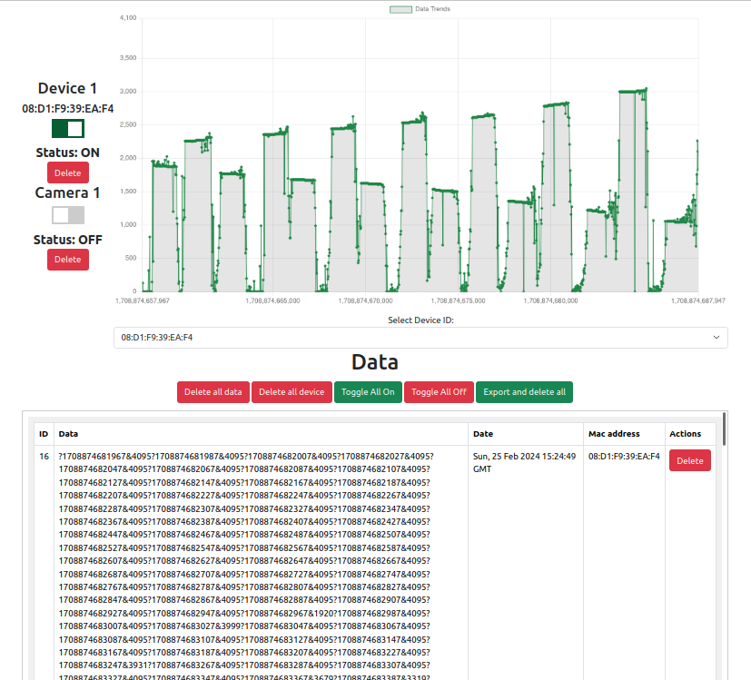
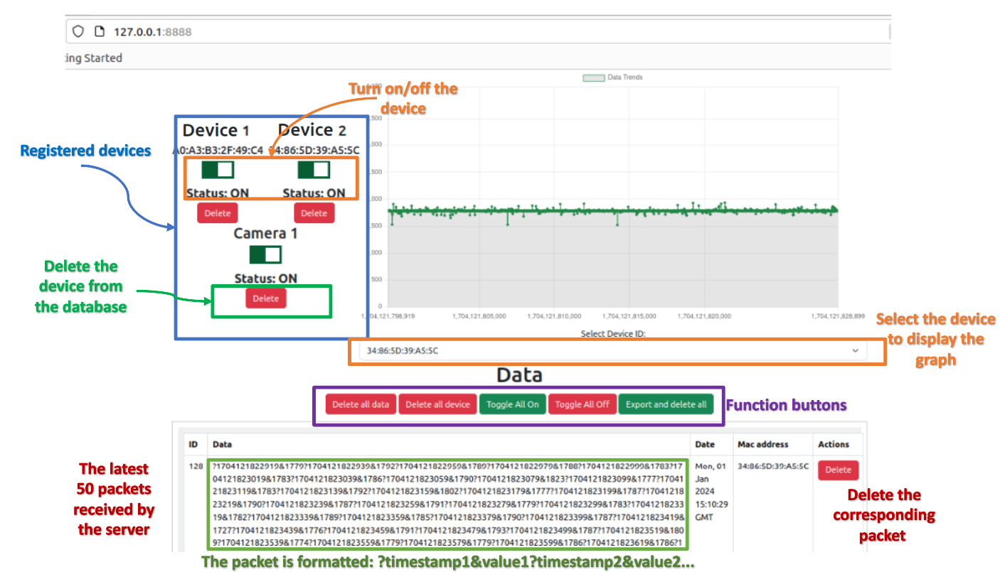

<a name="readme-top"></a>
<!-- PROJECT NAME -->
# [Flash Server for Database collection system serving smart PIR sensors][project-url]


<!-- TABLE OF CONTENTS -->
## Table of Contents
- [Flash Server for Database collection system serving smart PIR sensors](#flash-server-for-database-collection-system-serving-smart-pir-sensors)
  - [Table of Contents](#table-of-contents)
  - [About The Project](#about-the-project)
    - [Built With](#built-with)
  - [Getting Started](#getting-started)
    - [Prerequisites](#prerequisites)
    - [Deployment](#deployment)
  - [Usage](#usage)
  - [APIs List](#apis-list)
  - [Acknowledgments](#acknowledgments)


<!-- ABOUT THE PROJECT -->
## About The Project



Project objectives:
* Build a system to collect signals from PIR sensors and cameras to serve the model training process. ​
* Store data and process the obtained data.​
* There is an interface for users to perform tasks with data.

<p align="right">(<a href="#readme-top">back to top</a>)</p>


### Built With

* [![Python][Python-logo]][Python-url]
* [![Flask][Flask-logo]][Flask-url]
* [![Flask-sqlalchemy][Flask-sqlalchemy-logo]][Flask-sqlalchemy-url]

* [![Opencv][OpenCV-logo]][OpenCV-url]

<p align="right">(<a href="#readme-top">back to top</a>)</p>


<!-- GETTING STARTED -->
## Getting Started

This is an example of how you may give instructions on setting up your project locally.

### Prerequisites

First, you need to install Python and set up the environment.

* Install Python:
  * For MacOS/Linux:
    ```bash
    $ sudo apt-get update
    $ sudo apt-get install python3
    ```
  * For Windows:
    * you can [download Python][Python-url] and install from python website or using choco
    ```cmd
    > choco install python
    ```
* Install virtual environment:
  * Create a project folder and a `.venv` folder within:
    * For MacOS/Linux:
      ```bash
      $ mkdir myproject
      $ cd myproject
      $ python3 -m venv .venv
      ```
    * For Windows:
      ```cmd
      > mkdir myproject
      > cd myproject
      > python -m venv .venv
      ```
* Activate the environment:
  * Before you work on your project, activate the corresponding environment:
    * For MacOS/Linux:
      ```bash
      $ source .venv/bin/activate
      ```
    * For Windows:
      ```cmd
      > .venv\Scripts\activate
      ```
* Install libraries:
  * OpenCV, Flask, SQLAlchemy:
    ```bash
    $ pip install Flask Flask-SQLAlchemy opencv-python
    ```

 
### Deployment

* Deploy on the local network using Flask deploy tool:
  * Run in the terminal in the project folder:
    * MacOS/Linux:
      ```bash
      $ python3 main.py
      ```
    * Windows:
      ```cmd
      > python main.py
      ```

<p align="right">(<a href="#readme-top">back to top</a>)</p>


<!-- USAGE EXAMPLES -->
## Usage

After deploying the server, you can access the homepage via your_server_ip:8888 to interact with the server and database. You can see the features as shown below



<p align="right">(<a href="#readme-top">back to top</a>)</p>

<!-- API EXAMPLES -->
## APIs List

| API                 | Method   | Usage                                                                                                                    |
|---------------------|----------|--------------------------------------------------------------------------------------------------------------------------|
| `/delete-data`      | POST     | Delete data with corresponding id in the data table.                                                                     |
| `/delete-all`       | POST     | Delete all data in the data table.                                                                                        |
| `/reset-all`        | POST     | Delete all data in the device table.                                                                                      |
| `/delete-device`    | POST     | Delete the device with the corresponding id in the device table.                                                          |
| `/delete-camera`    | POST     | Delete the camera with the corresponding id in the camera table.                                                          |
| `/turn-on-all`      | POST     | Turn on all devices.                                                                                                     |
| `/status-change`    | POST     | Change the status of the device with the corresponding id.                                                                |
| `/camera-turn`      | POST     | Change the status of the camera with the corresponding id.                                                                |
| `/esp`              | GET      | Pass start and end variables, return JSON string data from the data table with ids from start to end.                    |
| `/esp`              | POST     | ESP32 sends data and saves it to the data table.                                                                         |
| `/device`           | GET      | Pass mac_adr variable, return JSON string data of devices with corresponding mac_adr.                                    |
| `/assign`           | GET      | Pass mac_adr variable for registration, return JSON success or failure message.                                         |
| `/export`           | GET      | Export all data and save it by device in a .csv file in a folder named after the Mac address. If successful, delete all data from the data table and return JSON success or failure message. |


<p align="right">(<a href="#readme-top">back to top</a>)</p>


<!-- CONTACT -->
<!-- ## Contact


<p align="right">(<a href="#readme-top">back to top</a>)</p>
 -->


<!-- ACKNOWLEDGMENTS -->
## Acknowledgments

* Project on ESP32 side: 
  [![github][github-logo]][project-esp-url]

<p align="right">(<a href="#readme-top">back to top</a>)</p>


<!-- MARKDOWN LINKS & IMAGES -->
[project-url]:https://github.com/krypt0n96e/pj01_PirFlaskServer
[project-esp-url]:https://github.com/krypt0n96e/pj01_PirEsp32Client
[github-logo]:https://img.shields.io/badge/github-121013?style=for-the-badge&logo=github&logoColor=white
[Python-logo]:https://img.shields.io/badge/python-3670A0?style=for-the-badge&logo=python&logoColor=ffdd54
[Python-url]: https://www.python.org/
[Flask-logo]:https://img.shields.io/badge/flask-%23000.svg?style=for-the-badge&logo=flask&logoColor=white
[Flask-url]: https://flask.palletsprojects.com/en/3.0.x/
[Flask-sqlalchemy-logo]:https://img.shields.io/badge/Flask_SQLalchemy-black.svg?style=for-the-badge
[Flask-sqlalchemy-url]:https://flask-sqlalchemy.palletsprojects.com/en/3.1.x/
[OpenCV-logo]:https://img.shields.io/badge/opencv-%23white.svg?style=for-the-badge&logo=opencv&logoColor=white
[OpenCV-url]:https://opencv.org/
